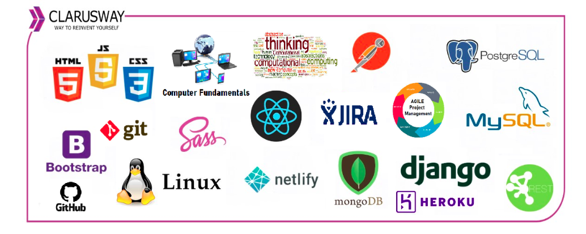
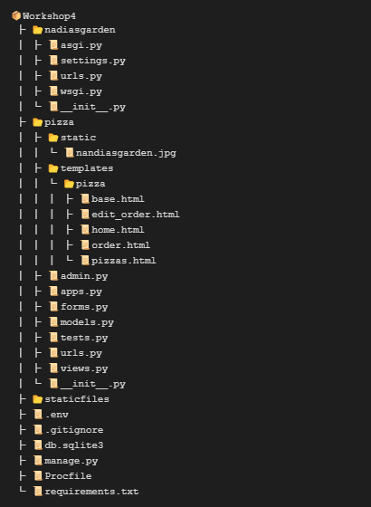

<center></center>
<br>

<center><h1>Django Class Notes</h1></center>
<p>Clarusway</p>
<br>

# Pizza App

### Nice to have VSCode Extentions:
- Djaneiro - Django Snippets

### Needs
- Python
- pip
- virtualenv

## Summary

- Introduction
- Spin up the project
- Create Models
- Create Forms (ModelForm)
  - Form fields
  - Widgets
- Create Views
  - home view
  - Creating templates
  - order view
    - Dealing with post requests
    - csrf
  - edit_order view
- Create url patterns
- Adding messages
- Adding base.html
- Adding bootstrap
- Adding navbar
- Working with static files

- (Optional) Adding authentication
- (Optional) Adding profile

## Introduction

In this session, we will create a Django app named "Nadia's Garden" which will let users to order pizza. 

Most websites require the use of forms to receive data from users, so it is crucial to know how to safely collect and handle data while maintaining a user-friendly experience on your website. In this course, learn how to use Django to create forms.

## Spin up the project

- Create a working directory, with a meaningful name, and cd to the new directory.

- Create a virtual environment as a best practice.
```py
python3 -m venv env # for Windows or
python -m venv env # for Windows
virtualenv env # for Mac/Linux or;
virtualenv env -p python3 # for Mac/Linux
```

- Activate the virtual environment.
```bash
.\env\Scripts\activate  # for Windows, may need to switch powershell on this operation.
source env/bin/activate  # for MAC/Linux
```

See the (env) sign before your command prompt.

- Install Django.
```bash
pip install django  # or
py -m pip install django
```
- (Optional) See installed python packages:
```sh
pip freeze

# you will see like:

# asgiref==3.5.0
# Django==4.0.4
# sqlparse==0.4.2
# tzdata==2022.1

# If you see lots of things here, that means there is a problem with your virtual env activation. Activate scripts again!
```
- Create the `requirements.txt` on your working directory, and send your installed packages to this file, requirements file must be up to date.
```py
pip freeze > requirements.txt
# In this project we will not use this file. But this is a standard procedure to learn.
```

- Create the project.
```py
django-admin startproject main . 
# With . it creates a single project folder.
# Avoiding nested folders.
# Naming depends on the company, team and the project.
```

- (Optional) If you created your project without "." at the end, change the name of the project main directory to src to distinguish it from a subfolder with the same name.
```bash
# Be careful to use your own folder names.
mv main src
```

- (Optional) Go to the same level with the `manage.py` file if you create your project with nested folders at step 7:
```bash
cd main  # or, if you changed;
cd src
```

- Create the app.
```py
# Using app name as "pizza"
python manage.py startapp pizza  # or
py -m manage.py startapp pizza

# Another naming:
python manage.py startapp home
py -m manage.py startapp home
```

- Go to the `settings.py` and add another line to the INSTALLED_APPS:
```py
'pizza',
```

- Run the server and check if your project up and running.
```py
python manage.py runserver  # or
py -m manage.py runserver
```

Go to http://localhost:8000/ in your browser. You should see Django rocket, which means you successfully created the project.

The installation worked successfully! Congratulations!


## Models:

In this project, you need to create a Size model, and a Pizza model with fields:

- Size:
  - title

- Pizza:
  - topping1
  - topping2
  - size (ForeignKey)


```py
from django.db import models


class Size(models.Model):
    title = models.CharField(max_length=6)
    def __str__(self):
        return self.title


class Topping1(models.Model):
    title =  models.CharField(max_length=10)
    def __str__(self):
        return self.title


class Topping2(models.Model):
    title =  models.CharField(max_length=10)
    def __str__(self):
        return self.title


class Pizza(models.Model):
    size = models.OnetoOneField(Size, on_delete=models.CASCADE)
    topping1 = models.ForeignKey(Topping1, on_delete=models.CASCADE)
    topping2 = models.ForeignKey(Topping2, on_delete=models.CASCADE)
    def __str__(self):
        return f'{self.size} - {self.topping1}  - {self.topping2}'
```


## Forms :

In this project, you need to create a PizzaForm using Pizza model. And also, you need to create a MultiplePizzaForm to order mored than one pizza at a time.

## Views:

In this project, you need to create four views:
- home
- order
- pizzas
- edit_order

## Templates:

In this project, you need to create four templates:

- home.html

- order.html

- pizzas.html

- edit_order.html

And one optional template for base.html.


## URLs:

In this project, you need to create four urls:
- '' : root path will return home page. 
- 'order/' : page to order pizza, showing pizza form.
- 'order/`<int:pk>`' : editing order.
- 'pizzas/' : to order more than one pizza.

## Project Folder Structure

At the end of the project, the folder sturcture will be like:




## Part 2 - Create Models
<br>
1. Go to models.py and create Size and Pizza models like below:

```py
from django.db import models

class Size(models.Model):
    title = models.CharField(max_length=100)
    
    def __str__(self):
        return self.title  # This is for good visual experimentation!

class Pizza(models.Model):
    topping1 = models.CharField(max_length=100)
    topping2 = models.CharField(max_length=100)
    size = models.ForeignKey(Size, on_delete=models.CASCADE)  # This is for correlation to the Size class
    
    def __str__(self):
        return self.size, self.topping1, self.topping2
```

<br>
2. See how to use ForeignKey. 

<br>
3. Discuss the differences between TextField and CharField.

<br>
4. Manage migrations:

```py
python manage.py makemigrations
python manage.py migrate
```

## Part 3 - Create Forms

1. Create forms.py under pizza app and create your forms like below:

```py
from django import forms
from .models import Pizza, Size


class PizzaForm(forms.ModelForm):
    
    class Meta:
        model = Pizza
        fields = ['topping1', 'topping2', 'size']
        labels = {'topping1':'Topping 1', 'topping2':'Topping 2'}

class MultiplePizzaForm(forms.Form):
    number = forms.IntegerField(min_value=2, max_value=6)
```


## Part 4 - Create Views and URLs

<br>
1. Go to views.py under "pizza" directory, and create your views like below:

```py
from django.shortcuts import render
from .forms import PizzaForm, MultiplePizzaForm  # referring to newly created forms.py and our new PizzaForm
from django.forms import formset_factory
from .models import Pizza
from django.contrib import messages

def home(request):
    return render(request, 'pizza/home.html')

def order(request):
    multiple_form = MultiplePizzaForm()
    if request.method == 'POST':
        # filled_form = PizzaForm(request.POST, request.FILES)
        filled_form = PizzaForm(request.POST)
        if filled_form.is_valid():
            created_pizza = filled_form.save()
            created_pizza_pk = created_pizza.id
            
            size = filled_form.cleaned_data.get('size')
            topping1 = filled_form.cleaned_data.get('topping1')
            topping2 = filled_form.cleaned_data.get('topping2')
            
            messages.success(request, f'Thanks for ordering! Your {size}, {topping1} and {topping2} pizza is on its way!')
            
            filled_form = PizzaForm()
            # return render(request, 'pizza/order.html', {'created_pizza_pk':created_pizza_pk, 'pizzaform':new_form, 'note':note, 'multiple_form':multiple_form})
        else:
            created_pizza_pk = None
            messages.warning(request, 'Pizza order failded, try again!')
            
        return render(request, 'pizza/order.html', {'created_pizza_pk':created_pizza_pk, 'pizzaform':filled_form, 'multiple_form':multiple_form})
    else:
        form = PizzaForm()
        return render(request, 'pizza/order.html', {'pizzaform':form, 'multiple_form':multiple_form})

def pizzas(request):
    number_of_pizzas = 2
    filled_multiple_pizza_form = MultiplePizzaForm(request.GET)
    if filled_multiple_pizza_form.is_valid():
        number_of_pizzas = filled_multiple_pizza_form.cleaned_data.get('number')
    PizzaFormSet = formset_factory(PizzaForm, extra=number_of_pizzas)
    formset = PizzaFormSet()
    if request.method == "POST":
        filled_formset = PizzaFormSet(request.POST)
        if filled_formset.is_valid():
            for form in filled_formset:
                form.save()
            messages.success(request, 'Pizzas have been ordered!')
            
        else:
            messages.warning(request, 'Order was not created, please try again')
            

        return render(request, 'pizza/pizzas.html', {'formset':formset})
    else:
        return render(request, 'pizza/pizzas.html', {'formset':formset})
    
def edit_order(request, pk):
    pizza = Pizza.objects.get(pk=pk)
    form = PizzaForm(instance=pizza)
    if request.method == 'POST':
        filled_form = PizzaForm(request.POST,instance=pizza)
        if filled_form.is_valid():
            filled_form.save()
            form = filled_form
            messages.success(request, 'Order has been updated.')
            
            return render(request, 'pizza/edit_order.html', {'pizzaform':form,'pizza':pizza})
    return render(request, 'pizza/edit_order.html', {'pizzaform':form,'pizza':pizza})
        
```

<br>
2. Discuss using formsets.
<br>
<br>
3. Include URL path of the new app to the project url list, go to urls.py and add:

```py
from django.contrib import admin
from django.urls import path, include

urlpatterns = [
    path('admin/', admin.site.urls),
    path('', include('pizza.urls'))
]
```

<br>
4. Add urls.py file under pizza directory and add:

```py
from django.urls import path
from .views import home, order, pizzas, edit_order

urlpatterns = [
    path('', home, name='home'),  # This is for home page
    path('order/', order, name='order'),  # This is for ordering page
    path('pizzas', pizzas, name='pizzas'),
    path('order/<int:pk>', edit_order, name='edit_order'),
]
```

## Part 5 - Create Templates 

<br>
1. Create templates/pizza folder and under that folder, create base.html file as a best practice. Create this base template including bootstrap like below:

```html
<!doctype html>
<html lang="en">
  <head>
    <!-- Required meta tags -->
    <meta charset="utf-8">
    <meta name="viewport" content="width=device-width, initial-scale=1, shrink-to-fit=no">

    <!-- Bootstrap CSS -->
    <link rel="stylesheet" href="https://stackpath.bootstrapcdn.com/bootstrap/4.2.1/css/bootstrap.min.css" integrity="sha384-GJzZqFGwb1QTTN6wy59ffF1BuGJpLSa9DkKMp0DgiMDm4iYMj70gZWKYbI706tWS" crossorigin="anonymous">

    <title>Nandia's Garden</title>
  </head>
  <nav class="navbar navbar-expand-lg navbar-dark" style="background-color: #238a44">
    <div class="container">
      <a class="navbar-brand" href="">Nandia's Garden</a>
      <div class="collapse navbar-collapse" id="navbarNav">
        <ul class="navbar-nav">
          <li class="nav-item active">
            <a class="nav-link" href="">Order Pizza</a>
          </li>
        </ul>
      </div>
    </div>
  </nav>

  <body>
    
    
    


    <!-- Optional JavaScript -->
    <!-- jQuery first, then Popper.js, then Bootstrap JS -->
    <script src="https://code.jquery.com/jquery-3.3.1.slim.min.js" integrity="sha384-q8i/X+965DzO0rT7abK41JStQIAqVgRVzpbzo5smXKp4YfRvH+8abtTE1Pi6jizo" crossorigin="anonymous"></script>
    <script src="https://cdnjs.cloudflare.com/ajax/libs/popper.js/1.14.6/umd/popper.min.js" integrity="sha384-wHAiFfRlMFy6i5SRaxvfOCifBUQy1xHdJ/yoi7FRNXMRBu5WHdZYu1hA6ZOblgut" crossorigin="anonymous"></script>
    <script src="https://stackpath.bootstrapcdn.com/bootstrap/4.2.1/js/bootstrap.min.js" integrity="sha384-B0UglyR+jN6CkvvICOB2joaf5I4l3gm9GU6Hc1og6Ls7i6U/mkkaduKaBhlAXv9k" crossorigin="anonymous"></script>
  </body>
</html>
```
<br>
2. Under templates/pizza folder create home.html as the second template, this will serve home page:

```html



    
    

```

<br>
3. Under templates/pizza folder create order.html as the third template, this will enable users to order pizza:

```html



<div class="container">
    <h1>Order pizza</h1>
    
    <div class="messages">
        
            <div class="">
                
                <p class="text-center alert alert-{{ message.tags }}" >
                Important:

                {{ message }}
                </p>
                
                </ul>
            </div>
        
    </div>

    <div style="text-align: center">
        
        <button><a href="">Edit Your Order</a></button><br>
        
    </div>

    <div>
        <form action="" method="POST">
            
            {{ pizzaform.as_p }}
            <input type="submit" value="Order Pizza">
        </form>

        <br><br>

        Want more than one pizza?

        <form action="", method="GET">
            {{ multiple_form.as_p }}
            <input type="submit" value="Get Pizzas">
        </form>
    </div>
</div>

```

<br>
4. Under templates/pizza folder create edit_order.html as the third template, this will enable users to edit their orders:

```html



<div class="container">

    <div class="messages">
        
            <div class="">
                
                <p class="text-center alert alert-{{ message.tags }}" >
                Important:
    
                {{ message }}
                </p>
                
                </ul>
            </div>
        
      </div>

    <form action="" method="post">
        
        {{ pizzaform.as_p }}
        <input type="submit" value="Edit Order">
    </form>
</div>

```
<br>
5. Under templates/pizza folder create pizzas.html as the third template, this will enable users to order more than one pizza at the same time:

```html




  
<div class="container"> 
  
  <h1>Order Pizzas</h1>


  <div class="messages">
    
        <div class="">
            
            <p class="text-center alert alert-{{ message.tags }}" >
            Important:

            {{ message }}
            </p>
            
            </ul>
        </div>
    
  </div>


  <form action="" method="POST">
    
      {{ formset.management_form }}

      
        {{ form }}
        <br><br>
      
      <input type="submit" value="Order Pizzas" />
    </form>
</div>


```

<br>
6. Run our project again to see our view:

```py
python manage.py runserver
py -m manage.py runserver
```

<br>
7. Go to http://localhost:8000/ in your browser, and check the functionality of your website. To stop the server use "CTRL + C"
<br>

<br>
8. If you want to send this project to your Github repo, do not forget to add .gitignore file, and secure your sensitive information like keys storing them locally in .env file and using python-decouple module.
<br>
<br>
9. Update the requirements.txt file after all your installations!

<br>
10. (Optional) Deploy your project to Heroku.

<br>
<hr>

**<p align="center">&#9786; Thanks for Attending &#9997;</p>**

<p>Clarusway</p>